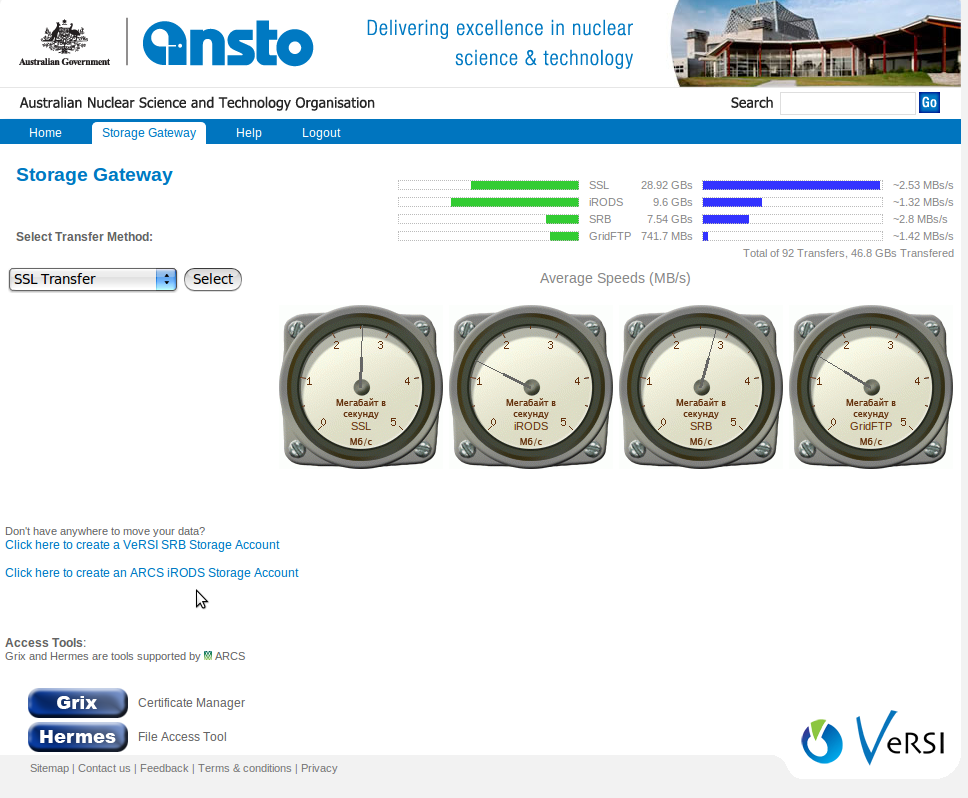
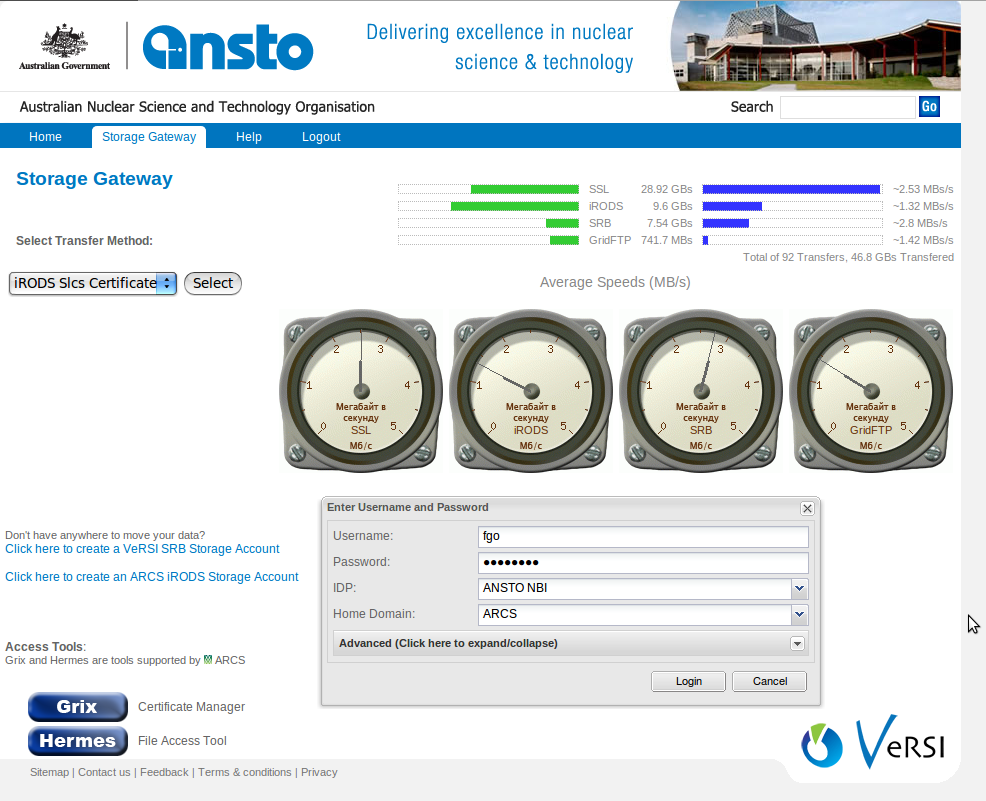
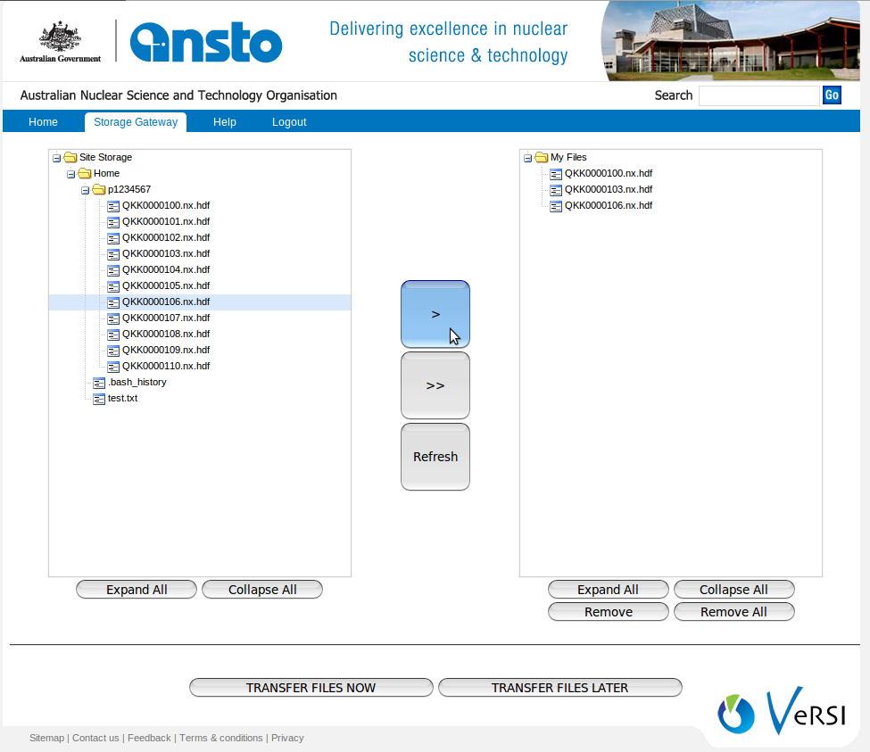
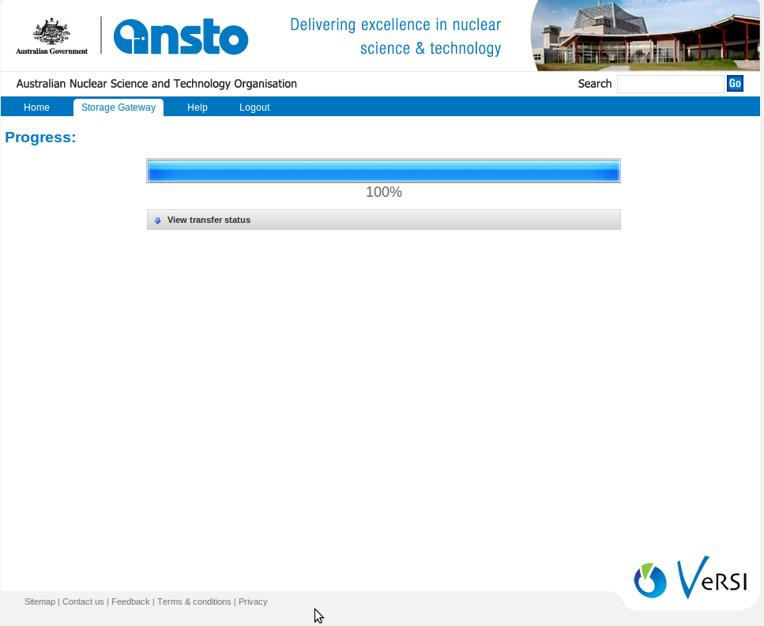
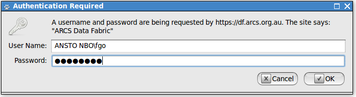
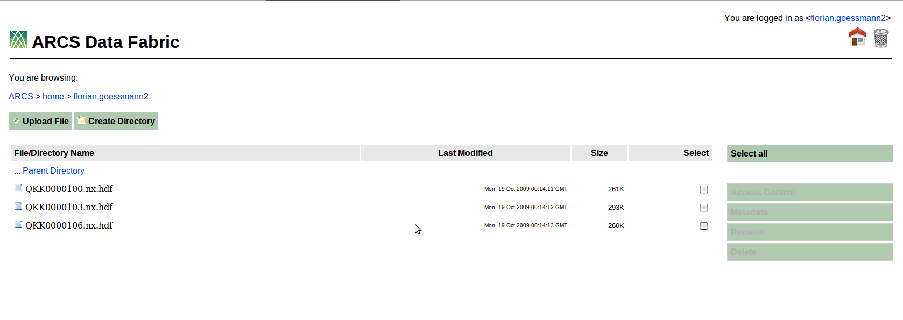

.. vim: set tw=78 ts=4 sw=4 et ft=rst:
.. $Id:$
.. $HeadURL:$

=====================================================
Copying Data to ARCS Data Fabric using StorageGateway
=====================================================

.. sectnum::

.. rubric:: Step by Step Guide to copy data to ARCS Data Fabric using Storage Gateway.

.. .. sidebar::

.. contents:: Contents:

ARCS Data Fabric
+++++++++++++++++

The ARCS Data Fabric can be used to store and share file based data.  A number
of different forms of access are possible. You can find more information about Data Fabric `Here <http://www.arcs.org.au/products-services/data-services/arcs-data-fabric-start-here>`_.

ANSTO Storage Gateway
++++++++++++++++++++++

ANSTO's `Storage Gateway <https://versi-vbl.nbi.ansto.gov.au/index.php>`_ is one of the client to upload files Data Fabric, As both Data Fabric and Storage Gateway supports Shibboleth Authentication, users need to have an account in any MAMS Level-2 IDPs before using Storage Gateway. For ANSTO's users they can use existing Ansto IDP [ANSTO NBI].

Login to Storage Gateway
-------------------------

Login with your username and password and then slect Storage Gateway from menu.

Login to Data Fabric with shibboleth authentication from Storage Gateway
-------------------------------------------------------------------------

Select **iRODS Slcs Certificate** as Transfer Method, then enter your IDP's username and password and select your IDP [ANSTO IDP for ANSTO users] and Home domain [ARCS]

Once authenticated successfully, click on start to start with transfering files to Data Fabric.

Transfering Files to Data Fabric
---------------------------------

It takes some time to load your home collection to Storage Gateway, once your files are loaded you can drag-and-drop files or use **>** button to copy files from left side window (your home collection) to right side window (files to be transfered to Data Fabric)

Click on TRANSFER FILES NOW button, to transfer files immidiately or you can even schedule transfer by clicking on TRANSFER FILES LATER button

Once Transfer is complete, you can login to Data Fabric to view, share, download etc.. operations to files.

Checking Your Files On Data Fabric using Web Browser
++++++++++++++++++++++++++++++++++++++++++++++++++++++

Login to `Data Fabric <https://df.arcs.org.au/ARCS/home>`_, By entering your IDP's username as **"YOUR IDP\USERNAME"** and password.

 

Once logged in to Data Fabric, you can find transferred files in your home directory (usually firstname.lastname) , you can do these operation on files stored in Data Fabric

1. Share with any Data fabric users
2. Download to local machine
3. Add metadata to files
4. Rename/Delete etc..

Contact/Help
++++++++++++

If you have any questions about Data Fabic or having any trouble accessing Data Fabric, please contact us

Email: **arcs-data@arcs.org.au or help@arcs.org.au**

Phone: **1800 TO ARCS (1800 862 727)**
