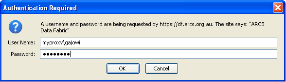

.. rst example file for testing use of rst for data fabric user docs
.. $Id$
.. $HeadURL$

title
=====

heading1
--------

An internal link to `later`_.

A list with a sub-list (4 spaces!).

* point 1
    * sub a
    * sub b
* point 2
* point 3

and some text _`later`.

a link to http://www.arcs.org.au

a link to somewhere__

__ http://www.arcs.org.au

an image

.. image:: http://intra.hpsc.csiro.au/images/GarethWilliams.jpg

